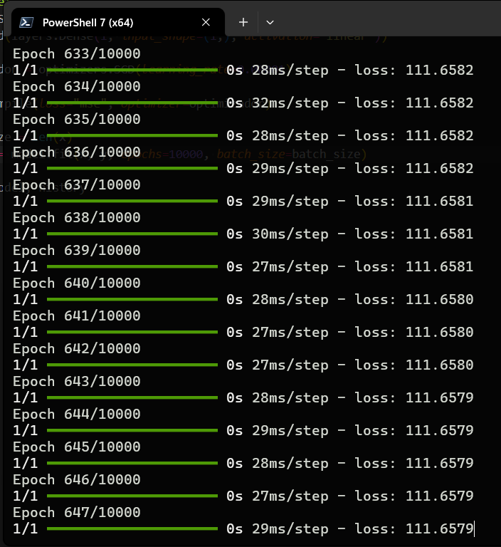
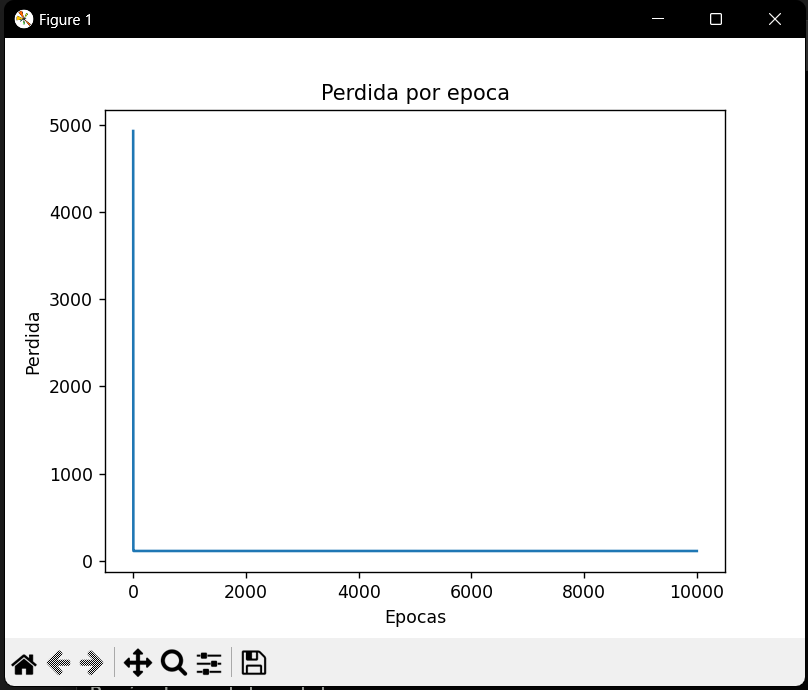
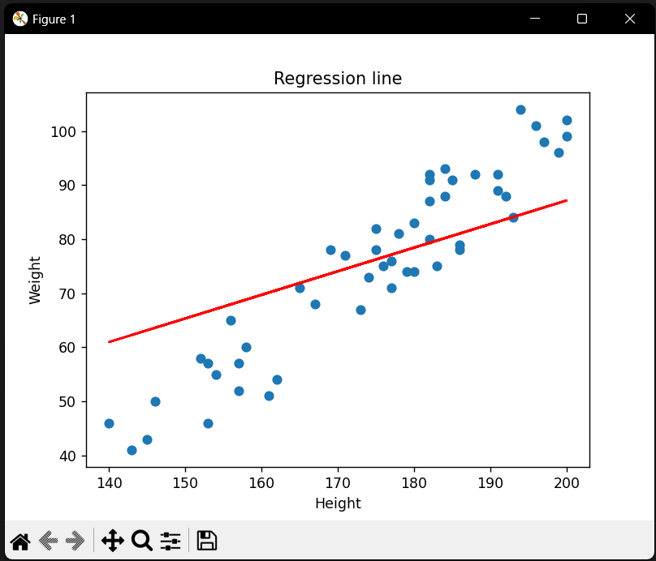

# Keras Practice Project

Este proyecto es una práctica de uso de Keras para entrenar un modelo de regresión lineal simple utilizando datos de altura y peso.

## Estructura del Proyecto

- `altura_peso.csv`: Archivo CSV con los datos de altura y peso.
- `data.py`: Script para cargar y preparar los datos.
- `model.py`: Script que define y entrena el modelo.
- `main.py`: Script principal que ejecuta el entrenamiento y visualiza los resultados.
- `requirements.txt`: Archivo con las dependencias del proyecto.
- `img/`: Carpeta con imágenes generadas durante el entrenamiento.

## Requisitos

Para instalar las dependencias necesarias, ejecuta:

```sh
pip install -r requirements.txt
Ejecución
Para ejecutar el proyecto, simplemente corre el script main.py:

Resultados
Entrenamiento del Modelo


Pérdida por Época


Línea de Regresión

```
